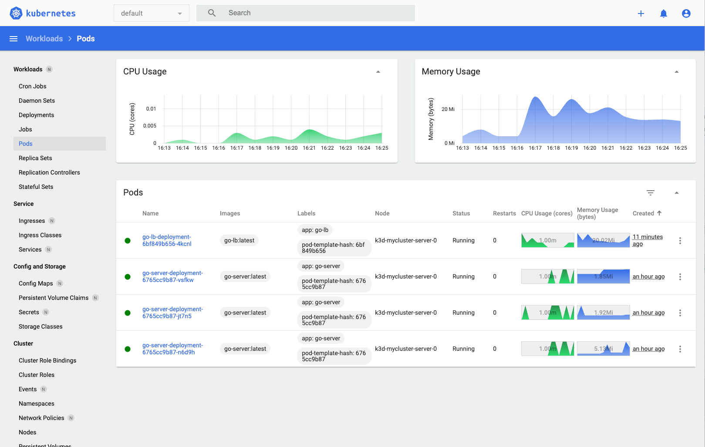

# Kubernetes Dashboard Setup

## Deploy

```sh
kubectl apply -f https://raw.githubusercontent.com/kubernetes/dashboard/v2.7.0/aio/deploy/recommended.yaml
```

## Access

Start proxy:

```sh
kubectl proxy
```

Open: http://localhost:8001/api/v1/namespaces/kubernetes-dashboard/services/https:kubernetes-dashboard:/proxy/

## Login Token

Create a service account and get its token:

```sh
kubectl create clusterrolebinding kubernetes-dashboard-admin \
  --clusterrole=cluster-admin \
  --serviceaccount=kubernetes-dashboard:kubernetes-dashboard
kubectl create token kubernetes-dashboard -n kubernetes-dashboard
```

Paste the token on the login page.

## Sample

Then you can view the dashboard:


