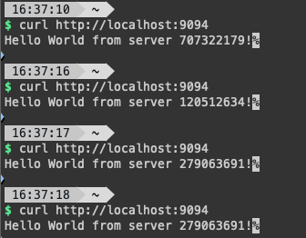

# Tutorial

## 1. Setup cluster

```bash
brew install k3d # simple wrapper of k3s for docker
k3d cluster start mycluster
```

## 2. Build & Push image

```bash
docker build -t go-lb:latest lb/ && k3d image import go-lb:latest -c mycluster
docker build -t go-server:latest server/ && k3d image import go-server:latest -c mycluster
```

## 3. Apply default permission for services to get cluster info

```bash
kubectl apply -f ./rbac/rbac.yaml
```

## 4. Deploy services

```bash
kubectl apply -f ./server/server-deployment.yaml
kubectl apply -f ./lb/lb-deployment.yaml
```

## 5. Port Forward LB service

```bash
# replace go-lb-deployment-6bf849b656-4kcnl with the name of your deployment
# find it from `kubectl get pods`
kubectl port-forward go-lb-deployment-6bf849b656-4kcnl 9094:8080
# open http://localhost:9094 in your browser, you should see the response from different server ids
```



## Optional Dashboard

View this guide [here](./DASHBOARD.md)

